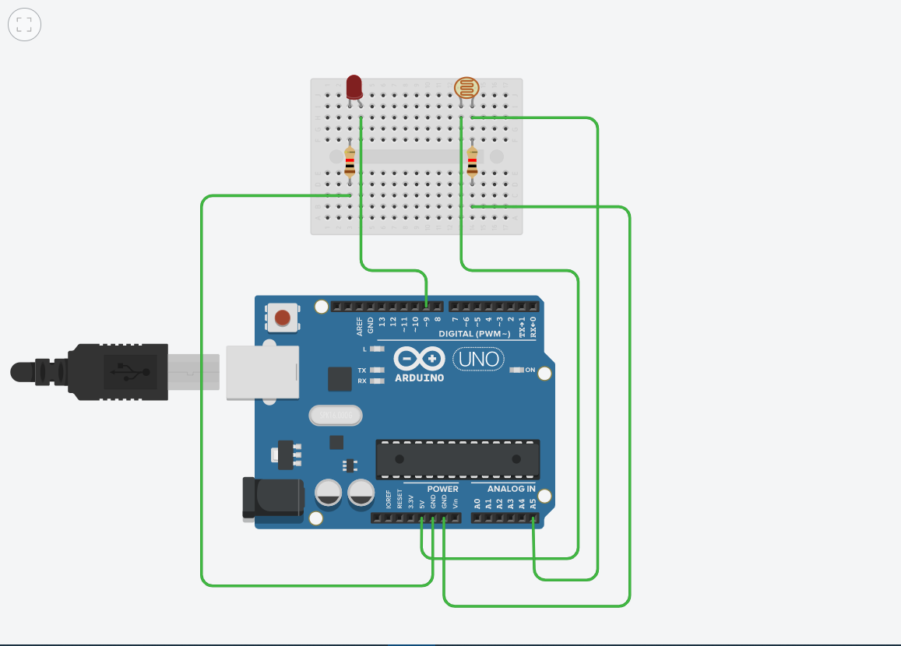

## Assignment

### Code

```
void setup()
{
  pinMode(9, OUTPUT);
  pinMode(A5, INPUT);
}

void loop()
{
  digitalWrite(9, LOW);
  if (analogRead(A5)<300)
    digitalWrite(9, HIGH);
  else
    digitalWrite(9, LOW);
}
```

### Circuit


