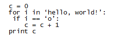
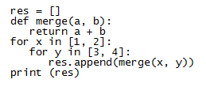

## Quiz

### Question 1

Assume that we have typed the following in the Python shell:

```
>>> x = ‘chemistry’
>>> x[3]
```

### Answer

m

### Question 2

Assume that we have typed the following in the Python shell:

```
>>> x = ‘chemistry’
>>> ‘i’ in x
```

### Answer

True

### Question 3

Assume that we have typed the following in the Python shell:

```
>>> x = ‘3’
>>> y = ‘4’
>>> x + y * 2
```

### Answer

344

### Question 4

Assume that we have typed the following in the Python shell:

```
>>> x = [1, 2]
>>> y = [3, 4]
>>> x.append(y)
>>> x
```

What will be printed on the screen as a result?

### Answer

[1, 2, [3, 4]]

### Question 5

Assume that the following Python program is executed:



What will be printed on the screen as a result?

### Answer

2

### Question 6

Assume that the following Python program is executed:



What will be printed on the screen as a result?

### Answer

[4, 5, 5, 6]

### Question 7

Correct indentation is essential for your Python program to work.

### Answer

True

### Question 8

Raspberry Pi can execute Python 3 code, but not Python 2.

### Answer

False
