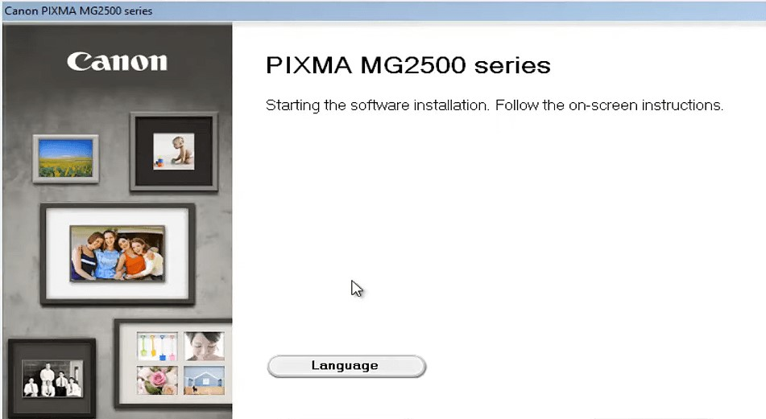

# Converting a wired Canon printer into wireless using a Raspberry Pi

## Requirement specification document:

At my house, I have the Canon PIXMA MG2470 All-in-One Inkjet Printer and it annoys me a lot when I have to print something, I have to carry my laptop to the living room to plug it into the printer and keep standing there until it is done printing, sometimes it takes a long time if there are a lot of pages and the printer is not very fast, especially if I have to print a coloured image or printout.

And then I got an idea after completing this specialization, I can turn it into a wireless printer using a Raspberry Pi instead of buying a new Wireless printer which will most probably cost around $200 - $300, whereas buying a Raspberry Pi with required equipment will be around \$50.

What I used was a $35 Raspberry Pi 4, and a $5 packet containing resistors and LED’s because I had already had a SD card on which I loaded Raspbian and some solder and other electrical stuff that I already had lying around at the house.

## What the user has to do:

• Download the software required for the printer.

• Choose the document to print.

• And select the printer. It will be available wirelessly if the user is connected to the same Wi-Fi.

## What I, as a developer have to do:

• Raspberry Pi should receive the file using Sockets and forward it to the printer.

• Order should be maintained i.e. Image that is received first should be printed first.

• File transfer speed should be fast so as to make the printing feasible and actually helpful. The file transfer speed should not depend on the internet speed.
