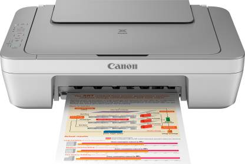

# Converting a wired Canon printer into wireless using a Raspberry Pi

## 1. Component Testing:

### The printer:

    Test the printer with a normal computer that has Windows on it
    Test the printer with a normal computer that has Linux on it
    Test the printer on Raspberry Pi using CUPS software
    Test the printer on Raspberry Pi using a shell command

### The server code:

    Test the server code by receiving a simple message
    Test the server code by receiving a file

### The client code:

    Test the client code by sending a simple message
    Test the client code by sending a file

### The LEDs:

    Test each LED individually
    Test LEDs together

## 2. Integration Testing:

### The printer & The server code:

    Test the server code by receiving a file and printing it

### The server code & The client code:

    Send a simple message from the client to the server
    Send a file from the client to the server

### The LEDs & The server code:

    Test LEDs on the server code

### The whole system:

    Send a file from the client to the server, print the file, and turn LEDs into high and low
