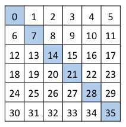

# Week 1 Quiz

### Question 1 
Python is an example of an
### Answer
Interpreted Language

### Question 2
Data Science is a
### Answer
Interdisciplinary, made up of all of the above

### Question 3 
Data visualization is not a part of data science.
### Answer
False

### Question 4 
Which bracketing style does Python use for tuples?
### Answer
( )

### Question 5 
In Python, strings are considered Mutable, and can be changed.
### Answer
False

### Question 6 
What is the result of the following code: `['a', 'b', 'c'] + [1, 2, 3]`
### Answer
`['a', 'b', 'c', 1, 2, 3]`

### Question 7 
String slicing is
### Answer
A way to make a substring of a string in python

### Question 8 
When you create a lambda, what type is returned? E.g. `type(lambda x: x+1)` returns
### Answer
`<class 'function'>`

### Question 9 
The epoch refers to
### Answer
January 1, year 1970

### Question 10 
This code, `[x**2 for x in range(10)]` , is an example of a
### Answer
List Comprehension

### Question 11
Given a 6x6 NumPy array r, which of the following options would slice the shaded elements?

### Answer
`r.reshape(36)[::7]`

### Question 12
Given a 6x6 NumPy array r, which of the following options would slice the shaded elements?

### Answer
`r[2:4,2:4]`
