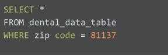

# Course Quiz

Scenario 1, question 1-5

You’ve just started a new job as a data analyst. You’re working for a midsized pharmacy chain with 38 stores in the American Southwest. Your supervisor shares a new data analysis project with you.

She explains that the pharmacy is considering discontinuing a bubble bath product called Splashtastic. Your supervisor wants you to analyze sales data and determine what percentage of each store’s total daily sales come from that product. Then, you’ll present your findings to leadership.

You know that it's important to follow each step of the data analysis process: ask, prepare, process, analyze, share, and act. So, you begin by defining the problem and making sure you fully understand stakeholder expectations.

One of the questions you ask is where to find the dataset you’ll be working with. Your supervisor explains that the company database has all the information you need.

Next, you continue to the prepare step. You access the database and write a query to retrieve data about Splashtastic. You notice that there are only 38 rows of data, representing the company’s 38 stores. In addition, your dataset contains five columns: Store Number, Average Daily Customers, Average Daily Splashtastic Sales (Units), Average Daily Splashtastic Sales (Dollars), and Average Total Daily Sales (All Products).

### Question 1

You know that spreadsheets work well for processing and analyzing a small dataset, like the one you’re using. To get the data from the database into a spreadsheet, what should you do?

### Answer

Download the data as a .CSV file, then import it into a spreadsheet.

### Question 2

You’ve downloaded the data from your company database and imported it into a spreadsheet. To use the dataset for this scenario, click the link below and select “Use Template.”
Now, it’s time to process the data. As you know, this step involves finding and eliminating errors and inaccuracies that can get in the way of your results. While cleaning the data, you notice that information about Splashtastic is missing in row 16. The best course of action is to delete row 16 from your dataset so the missing data doesn’t get in the way of your results.

### Answer

False

### Question 3

Once you’ve found the missing information, you analyze your dataset.

During analysis, you create a new column F. At the top of the column, you add: Average Percentage of Total Sales - Splashtastic. What is this column label called?

### Answer

An attribute

### Question 4

Next, you determine the average store sales of Splashtastic over the past 12 months at all stores, The range that contains these sales is E2:E39. To do this, you use a function. Fill in the blank to complete the function correctly: =**\_** (E2:E39).

### Answer

AVERAGE

### Question 5

You’ve reached the share phase of the data analysis process. It involves which of the following? Select all that apply.

### Answer

    Create a data visualization to highlight the Splashtastic sales insights you've discovered.
    Prepare a slideshow about Splashtastic’s sales and practice your presentation.
    Present your findings about Splashtastic to stakeholders.

Scenario 2, questions 6-10

You’ve been working for the nonprofit National Dental Society (NDS) as a junior data analyst for about two months. The mission of the NDS is to help its members advance the oral health of their patients. NDS members include dentists, hygienists, and dental office support staff.

The NDS is passionate about patient health. Part of this involves automatically scheduling follow-up appointments after crown replacement, emergency dental surgery, and extraction procedures. NDS believes the follow-up is an important step to ensure patient recovery and minimize infection.

Unfortunately, many patients don’t show up for these appointments, so the NDS wants to create a campaign to help its members learn how to encourage their patients to take follow-up appointments seriously. If successful, this will help the NDS achieve its mission of advancing the oral health of all patients.

Your supervisor has just sent you an email saying that you’re doing very well on the team, and he wants to give you some additional responsibility. He describes the issue of many missed follow-up appointments. You are tasked with analyzing data about this problem and presenting your findings using data visualizations.

An NDS member with three dental offices in Colorado offers to share its data on missed appointments. So, your supervisor uses a database query to access the dataset from the dental group. The query instructs the database to retrieve all patient information from the member’s three dental offices, located in zip code 81137.

### Question 6

The table is dental_data_table, and the column name is zip_code. You write the following query, but get an error. What statement will correct the problem?

### Answer

WHERE zip_code = 81137

### Question 7

The dataset your supervisor retrieved and imported into a spreadsheet includes a list of patients, their demographic information, dental procedure types, and whether they attended their follow-up appointment. To use the dataset for this scenario, click the link below and select “Use Template.”
The patient demographic information includes data such as age and gender. As you’re learning, it’s your responsibility as a data analyst to make sure your analysis is fair. The fact that the dataset includes people who all live in the same zip code might get in the way of fairness.

### Answer

True

### Question 8

As you’re reviewing the dataset, you notice that there are a disproportionate number of senior citizens. So, you investigate further and find out that this zip code represents a rural community in Colorado with about 800 residents. In addition, there’s a large assisted-living facility in the area. Nearly 300 of the residents in the 81137 zip code live in the facility.

You recognize that’s a sizable number, so you want to find out if age has an effect on a patient’s likelihood to attend a follow-up dental appointment. You analyze the data, and your analysis reveals that older people tend to miss follow-ups more than younger people.

So, you do some research online and discover that people over the age 60 are 50% more likely to miss dentist appointments. Sometimes this is because they’re on a fixed income. Also, many senior citizens lack transportation to get to and from appointments.

With this new knowledge, you write an email to your supervisor expressing your concerns about the dataset. He agrees with your concerns, but he’s also impressed with what you’ve learned and thinks your findings could be very important to the project. He asks you to change the business task. Now, the NDS campaign will be about educating dental offices on the challenges faced by senior citizens and finding ways to help them access quality dental care.

Fill in the blank: Changing the business task involves defining a new **\_**.

### Answer

question or problem to be solved

### Question 9

You continue with your analysis. In the end, your findings support what you discovered during your online research: As people get older, they’re less likely to attend follow-up dental visits.

But you’re not done yet. You know that data should be combined with human insights in order to lead to true data-driven decision-making. So, your next step is to share this information with people who are familiar with the problem. They’ll help verify the results of your data analysis.

Fill in the blank: The people who are familiar with a problem and help verify the results of data analysis are **\_**.

### Answer

subject-matter experts

### Question 10

The subject-matter experts are impressed by your analysis. The team agrees to move to the next step: data visualization. You know it’s important that stakeholders at NDS can quickly and easily understand that older people are less likely to attend important follow-up dental appointments. This will help them create an effective campaign for members.

It’s time to create your presentation to stakeholders. It will include a data visualization that depicts the relationship between age and follow-up dental appointment attendance rates. For this, a doughnut chart will be most effective.

### Answer

False
